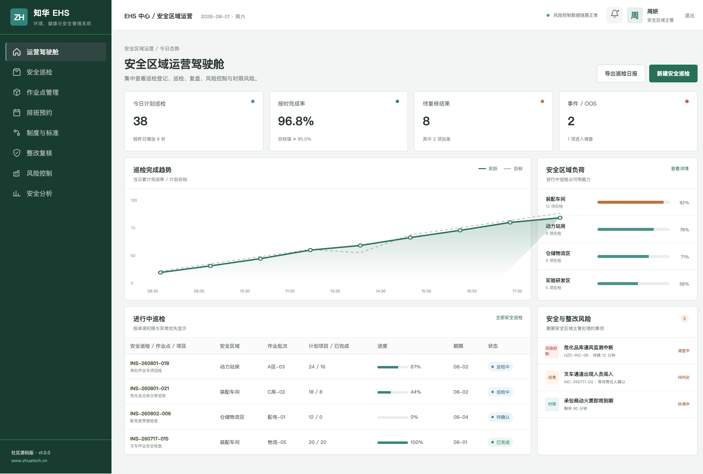
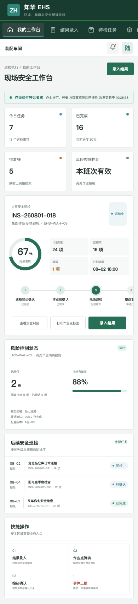

# ZhuaTech EHS

## 环境、健康与安全管理社区源码版

作业许可、现场巡检、隐患整改、事故事件与安全分析，一套系统形成闭环。

[](backend/pom.xml) [](frontend/package.json) [](compose.yaml) [](LICENSE)

本项目由知华科技（上海如静知华信息科技有限公司）维护。企业级 EHS 定制、私有化部署与产品信息见[知华科技官网](https://www.zhuatech.cn/)。

### 管理者看到的安全态势

管理端围绕区域、巡检计划、隐患等级、整改时限和事件状态组织信息，减少“表格散落、责任不清、到期无人跟进”的情况。



### 安全员的现场入口

H5 工作台适合现场使用，提供巡检任务、检查项、控制措施、隐患位置、整改责任与事件上报入口。



### 功能清单

| 场景 | 能力 |
| --- | --- |
| 风险预防 | 安全区域、风险分级、控制措施、作业许可 |
| 现场执行 | 巡检计划、移动检查、异常上报、照片与记录索引 |
| 闭环整改 | 隐患分派、临时措施、整改复核、逾期预警 |
| 事件管理 | 未遂事件、事故登记、调查复盘、纠正措施 |
| 管理分析 | 巡检完成率、隐患趋势、区域负荷、整改周期 |

### 架构与启动

前后端分离：后端 Java 21 + Spring Boot + Spring Security + JPA + Flyway（包名 `cn.zhuatech.ehs`），前端 Vue 3 + Pinia + Vue Router + Vite，数据库 MySQL 8。

```bash
cd frontend
npm install
npm run dev:demo
```

浏览器打开 `http://localhost:5173`，管理端使用 `planner / Demo@2026`，安全员端使用 `operator / Demo@2026`。也可复制 `.env.example` 后执行 `docker compose up --build` 启动完整环境。所有演示人员、区域、事件和指标均为虚构数据。

### 授权声明

本工程仅允许个人学习、研究和非商业技术交流，**不得商用**。企业内部运行、生产部署、商业交付、SaaS、收费服务、咨询实施和品牌替换等用途，须提前取得上海如静知华信息科技有限公司书面授权，完整条款请阅读 [LICENSE](LICENSE)。

深度开发、行业适配或商业授权，请访问[知华科技官网](https://www.zhuatech.cn/)或通过以下微信二维码咨询：

| 微信咨询 1 | 微信咨询 2 |
| --- | --- |
|  |  |

关键词：EHS 系统源码、安全生产管理、隐患排查治理、事故事件管理、Java EHS、知华科技。

## 事故严重度分级

新增 `POST /api/admin/incident-severity`，综合受影响人数、医疗处置、误工、环境释放、财产损失、控制失效和重复事件计算严重度。重大事件会触发紧急响应，并返回救治、控制、报告与根因分析动作。

## 作业许可准备度

新增 `POST /api/ehs/insights/permit-to-work-readiness`。高风险作业开始前检查气体检测、上锁挂牌、人员资质、许可审批和应急预案，返回 `READY`、`PREPARE` 或 `BLOCK` 并列出缺失项，帮助现场负责人形成可追溯的开工门禁。
